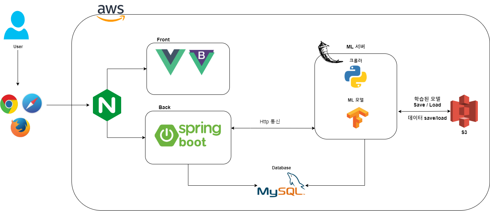
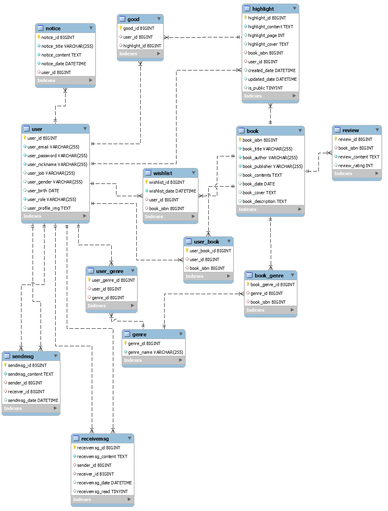
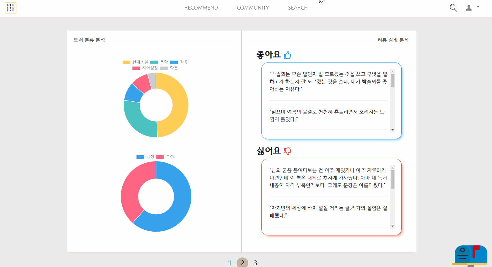
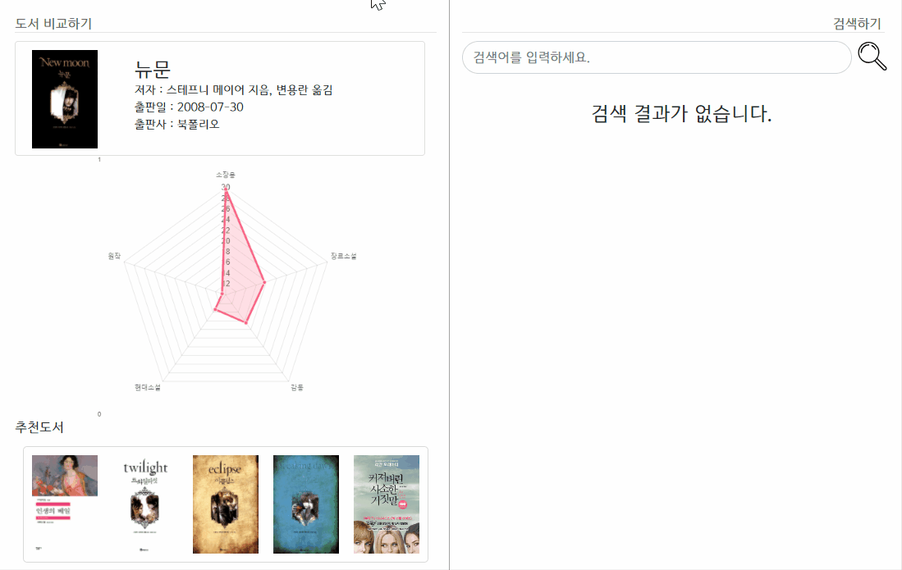
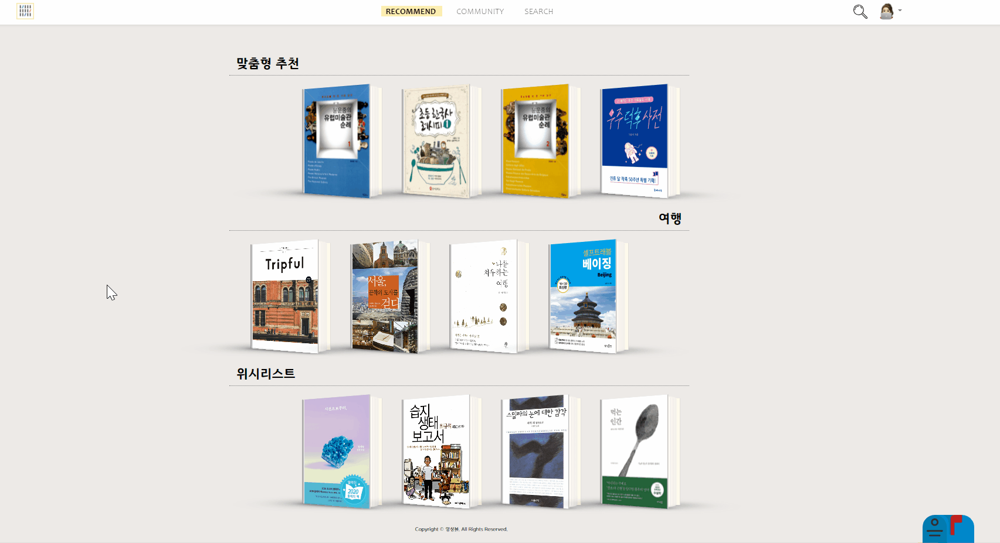
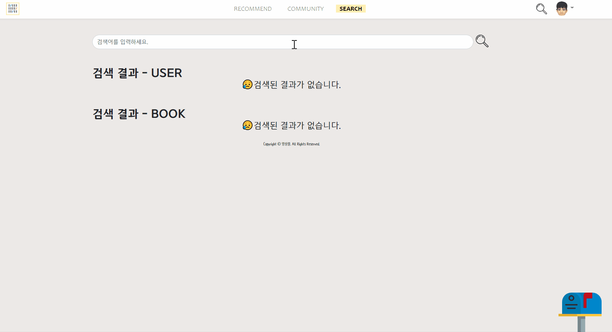
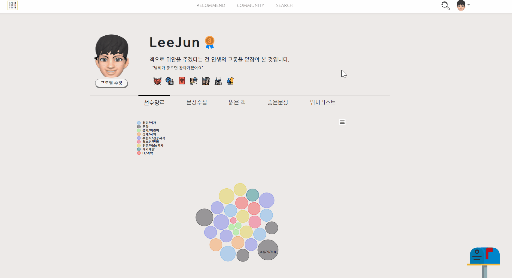
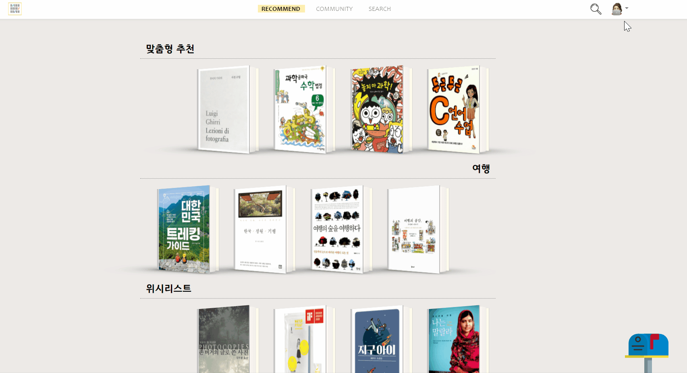
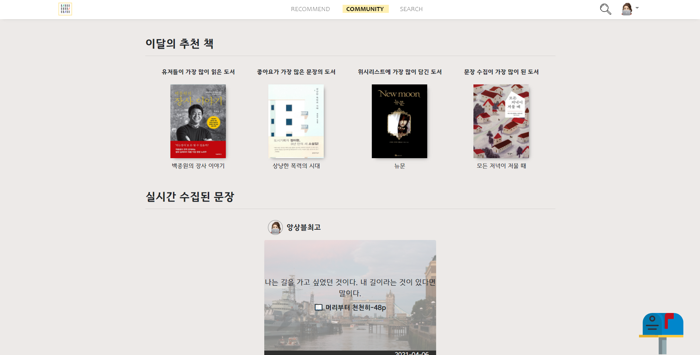
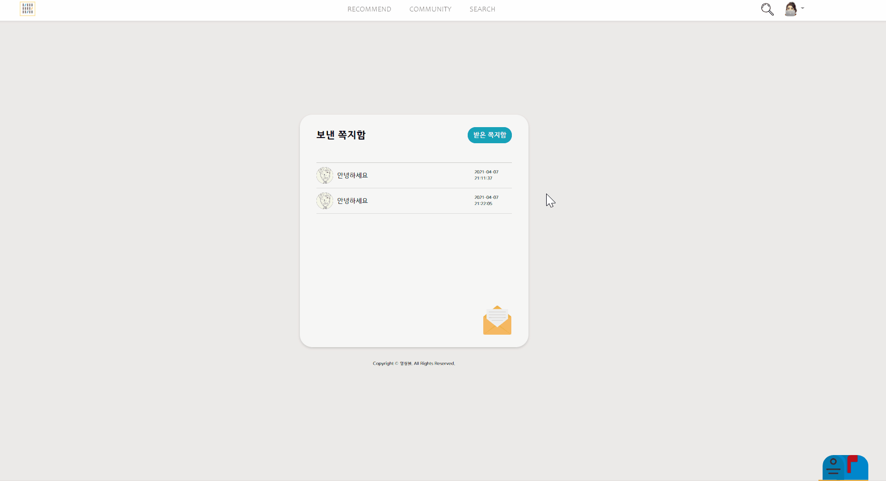

# SSAFY - 삼성전자 네트워크 사업부 (넷싸 프로젝트)

> 프로젝트 주제 : 머신러닝을 활용한 리뷰 분석 시스템 개발  
> 서비스 명 : 북플렉스  
> 팀명 : 앙상블  
> 개발기간 : 2021.02.22 ~ 20201.04.07 (7주)  
> 배포 주소 : https://j4f004.p.ssafy.io

# 📚[북플렉스](https://j4f004.p.ssafy.io)란?

**머신러닝을 활용한 리뷰 분석과 도서 추천을 결합한 나만의 맞춤 도서 추천 서비스**

- **머신러닝을 이용한 리뷰 감성분석, 키워드 분류**를 통해 책의 정보를 더 직관적으로 확인할 수 있을 뿐만 아니라 다른 책들과 비교도 한눈에 확인 가능합니다
- **8만 8천권**의 책 데이터를 기반으로 사용자가 읽은 책, 선호하는 장르등을 분석해 **사용자 맞춤 책 추천 서비스**를 제공합니다
- 책을 읽으며 감동받은 **문장을 수집**하고 이를 다른사람들과 공유할 수 있습니다

# 👨‍👩‍👧‍👦팀원 소개

|     이름      |            역할             |                  Contact                  |
| :-----------: | :-------------------------: | :---------------------------------------: |
| 곽온겸 (팀장) |      FE, ML 모델 개발       |  [Github](https://github.com/AntBean94)   |
|    김민혁     | BE, DevOps, 추천서비스 개발 |  [Github](https://github.com/glenn93516)  |
|    우희정     |    FE, BE, ML 모델 개발     |  [Github](https://github.com/hjmwoo1208)  |
|    이강림     |    FE, BE, ML 모델 개발     |  [Github](https://github.com/leekangrim)  |
|    조명희     |          기획, FE           | [Github](https://github.com/Jo-Myounghee) |

# 📁프로젝트 구조

## 📃문서

📃[컨벤션 및 Git 브랜치 전략](https://www.notion.so/3c2d5bfe31a548628bdb70238f0e2b68)  
📃[회의록](https://www.notion.so/SSAFY-MEETING-fb956dfd180e49a185007fc27b67d1c5)  
📃[추천 알고리즘](https://www.notion.so/ac2bbe43b3824bceac81f3b50a5e7eda)

## 📁프로젝트 실행 방법

```bash
docker-compose up
```

## 📁기술 스택

|     분류      |                                                                                                                                        기술                                                                                                                                         |
| :-----------: | :---------------------------------------------------------------------------------------------------------------------------------------------------------------------------------------------------------------------------------------------------------------------------------: |
|   Front-end   |                                                                                                                                                                                                             |
|   Back-end    |   ,  |
|      ML       |                                                                                                                                          |
|      DB       |                                                                                                                                                                                                                  |
|     CI/CD     |                                                                                                                                              |
| Communication |                                                                                                                                      |

## 📁시스템 아키텍쳐

  


## 📁ERD



## 📁패키지 구조

### 백엔드

`spring boot`

```bash
backend
├─ .gitignore
├─ build.gradle
├─ ...
└─ src
   ├─ main
   │  ├─ java
   │  │   └─ backend
   │  │       ├─ controller    : 컨트롤러 폴더
   │  │       │    ├─  ABCController.java
   │  │       │    └─  ...
   │  │       ├─ service       : 서비스 폴더
   │  │       │    ├─  (Interface) ABCService.java
   │  │       │    ├─  ABCServiceImpl.java
   │  │       │    └─  ...
   │  │       ├─ mapper        : mapper 인터페이스
   │  │       │    ├─ ABCMapper.java
   │  │       │    └─ ...
   │  │       ├─ dto
   │  │       ├─ config        : 설정 파일 (swagger, security, ...)
   │  │       │    ├─  security
   │  │       │    └─  ...
   │  │       ├─ exception
   │  │       ├─ utils
   │  │       ├─ interceptor
   │  │       └─ BackendApplication.java
   │  └─ resources
   │     ├─ mappers            : Mybatis mapper 폴더
   │     │  └─ abc.xml
   │     ├─ application.yml    : 설정 파일
   │     ├─ mybatis-config.xml : mybatis 설정 파일
   │     └─ ...
   └─ test                     : 테스트 폴더
```

`flask`

```bash
flask
├─ app.py
├─ Dockerfile
├─ requirements.txt
├─ apis    : API Endpoints
│    ├─  recommendation.py
│    └─  ...
├─ models  : ORM 모델들
│    ├─  Book.py
│    ├─  Genre.py
│    └─  ...
└─ data    : 필요한 데이터들 (saved model, ...)
    ├─ lda
    └─ ...
```

### 프론트 엔드

```bash
frontend
├─ Dockerfile
├─ ...
└─ src
    ├─  assets      : 로고, 이미지 파일
    │      └─ ...
    ├─  components  : 컴포넌트
    │      ├─ Book
    │      └─ ...
    ├─  router      : 라우팅
    │      └─ index.js
    ├─  store       : vuex
    │      └─ index.js
    ├─  views       : 페이지
    │      └─ ...
    ├─  App.vue
    └─  main.js

```

# 📚주요 기능

## 메인 페이지(읽은 책, 선호 장르, 위시리스트 기반 추천)

### 👩유저 A (문학, 예술, 여행 관련 도서 선호)


### 🧑유저 B (프로그래밍 관련 도서 선호)


## 책 상세 페이지

### 키워드 분석


### 감정 분석 + 토픽 분석



### 책 비교



## 문장 수집



## 책 검색



## 유저 페이지

### 선호 장르 분석



### 읽은 책 & 수집한 문장



## 커뮤니티

### 문장수집



### 쪽지



# 🏆수상

- SSAFY-삼성전자 네트워크 사업부 프로젝트 전체 2위🥈
- 베스트 팀 2회 수상 🏅
- 베스트 멤버 수상 (곽온겸) 🏅
