# 사용 방법

### 1. vscode 실행

- 파일 내부 우클릭 >  `vscode(으)로 열기 ` 클릭

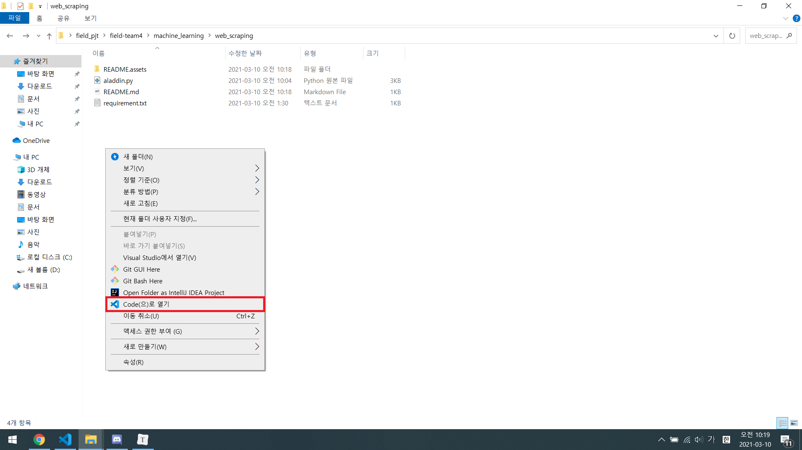


### 2. 가상환경 생성

- 터미널 열기/닫기 : Ctrl + `
- 명령어 입력

   ```bash
   $ python -m venv venv
   ```

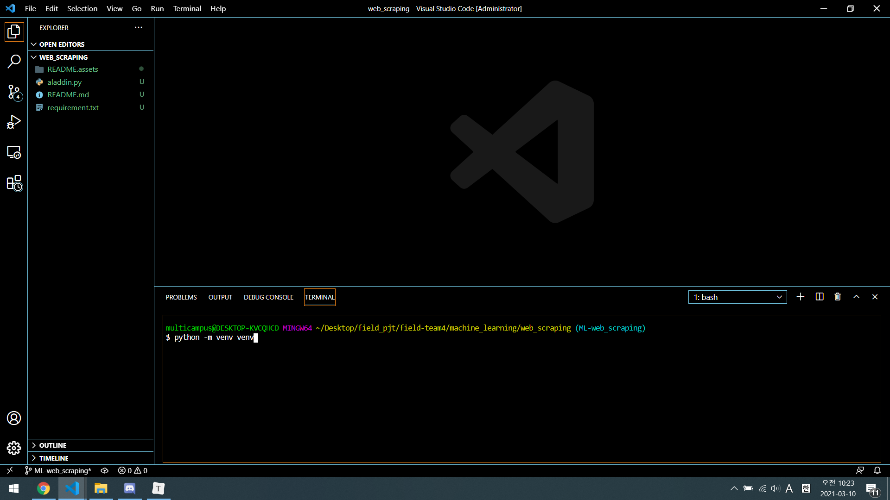

- 생성 완료


### 3. 가상환경 실행

- 명령어 입력

```bash
$ source venv/Scripts/activate
```

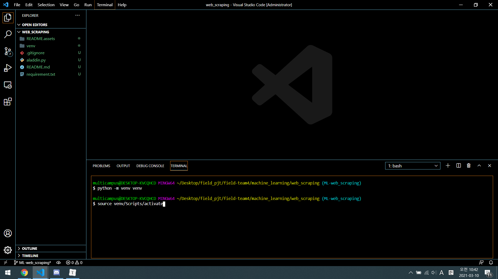

- 살행 완료

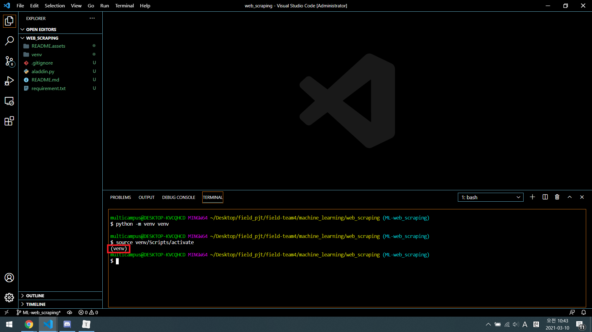


### 4. 라이브러리 설치

- 명령어 입력

```bash
$ pip install -r requirement.txt
```

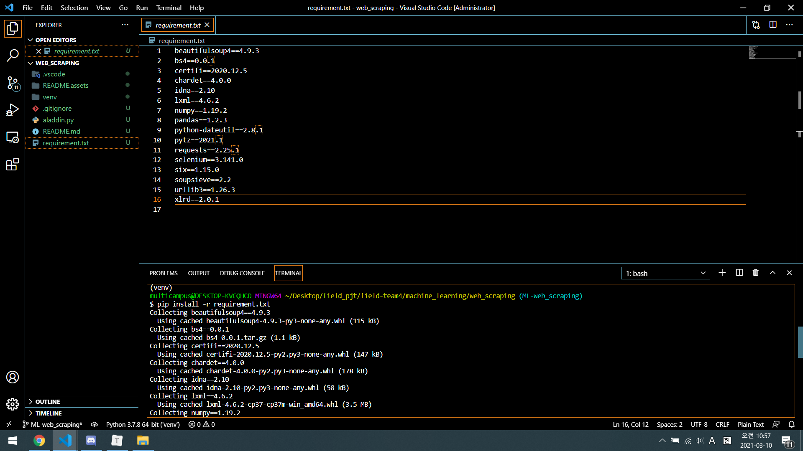

- 설치 완료 (WARNING 무시 : pip 버전을 업그레이드하라는 것, 필요 없음)

```
WARNING: You are using pip version 20.1.1; however, version 21.0.1 is available.
You should consider upgrading via the 'c:\users\multicampus\desktop\field_pjt\field-team4\machine_learning\web_scraping\venv\scripts\python.exe -m pip install --upgrade pip' command.
```

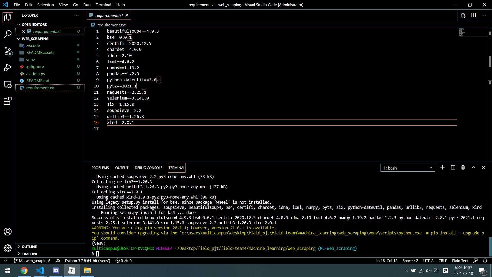


### 5. Extensions 설치

- Extensions 클릭

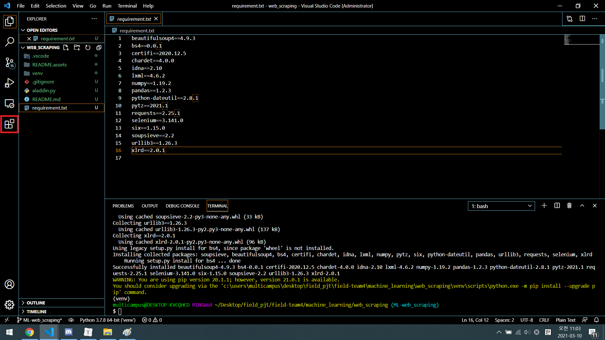

-  필요 Extensions 설치

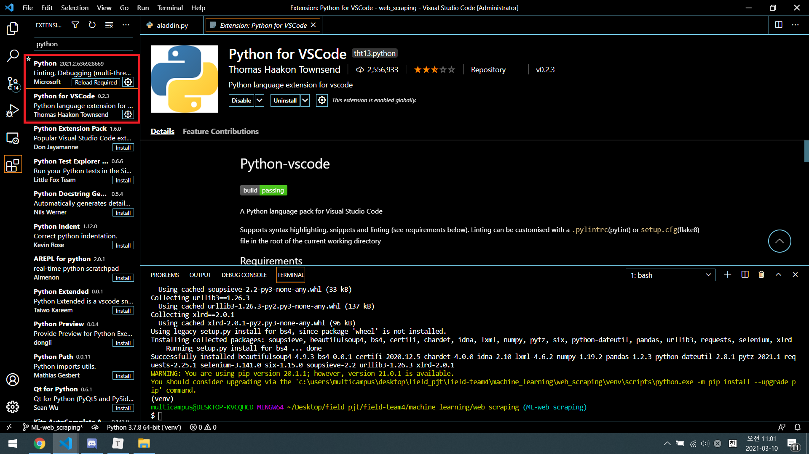


### 6. 웹스크래핑 실행

- 파일 준비 : 밑에 진행 완료 파일을 제외하고 1~2개 정도 csv 파일을 현재 파일로 가져온다.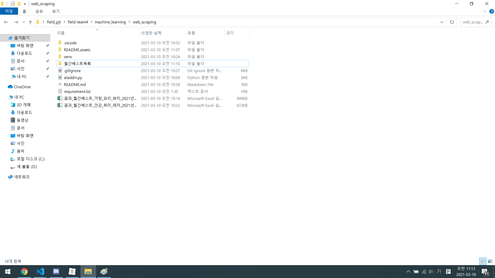
  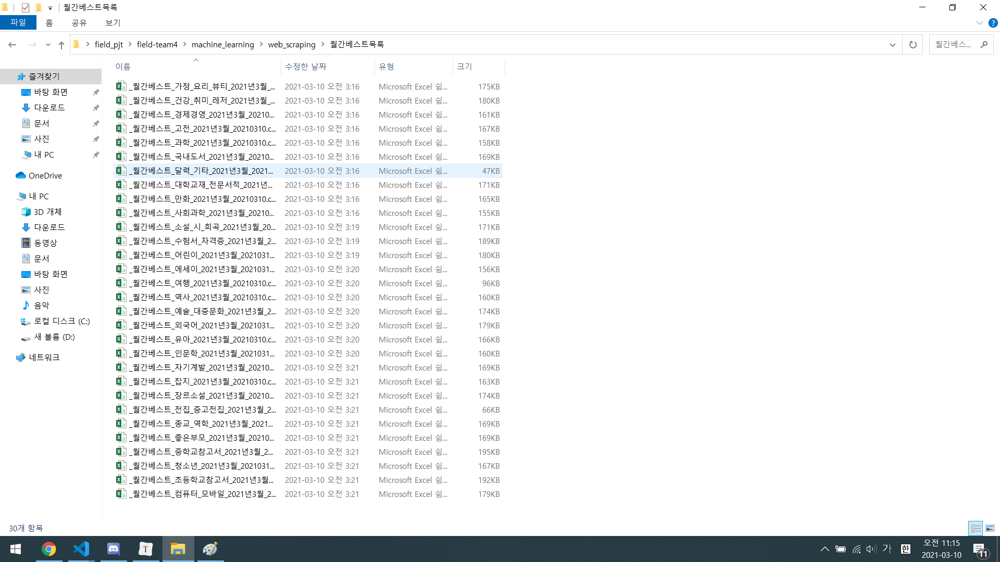
  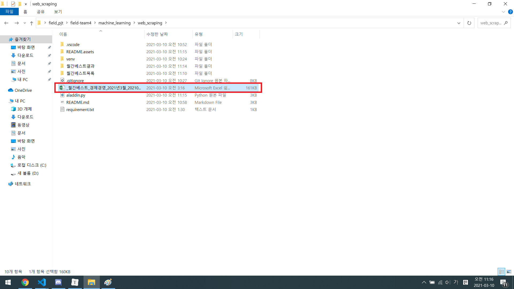

- aladdin.py 실행

  1. 버튼 클릭
     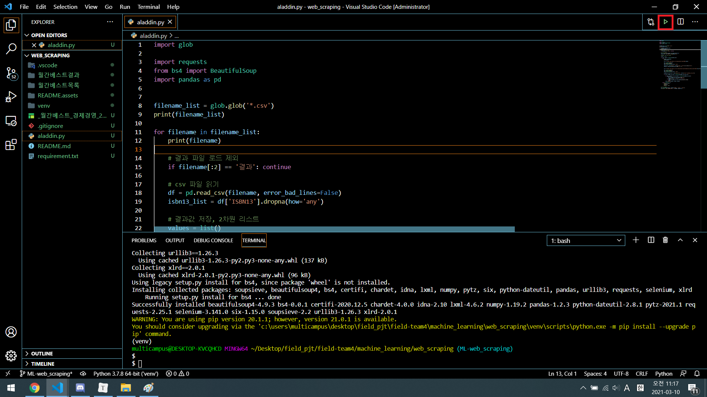

  2. 명령어 입력

     ```bash
     $ python aladdin.py
     ```

     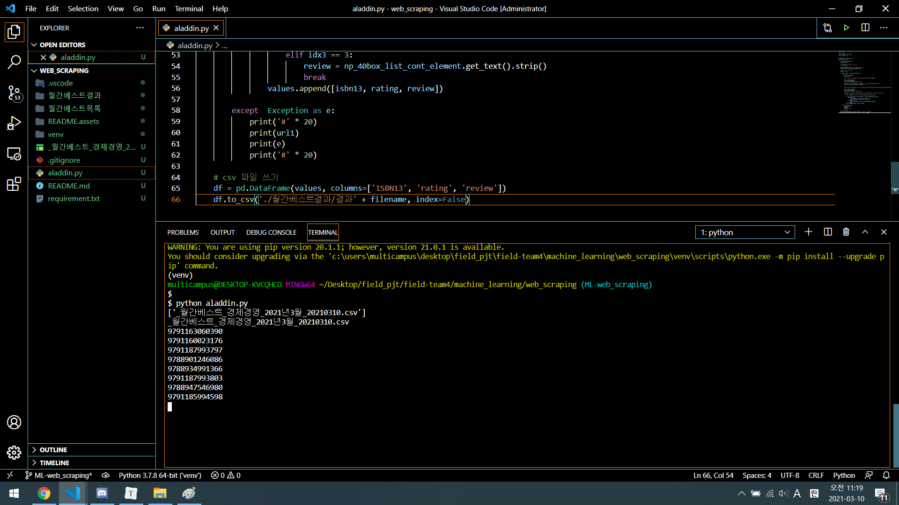


### 7. 참고 : requirement.txt

- 구성 : 각 라이브러리 이름, 버전

- 생성 방법

  - 명령어 입력

    ```bash
    $ pip freeze > requirement.txt
    ```


# 진행 완료 파일

- _월간베스트_가정_요리_뷰티_2021년3월_20210310
- _월간베스트_건강_취미_레저_2021년3월_20210310


# 관련 URL

- 파이썬 정규 표현식 학습
  - https://www.w3schools.com/python/python_regex.asp
  - https://docs.python.org/3/library/re.html
- BeautifulSoup4 공식문서(한글)
  - https://www.crummy.com/software/BeautifulSoup/bs4/doc.ko/
- User Agent String
  - https://www.whatismybrowser.com/detect/what-is-my-user-agent
- selenium with python
  - https://selenium-python.readthedocs.io/
- Chrome Driver
  - 크롬버전 확인용 url : chrome://version
  - https://chromedriver.chromium.org/downloads

